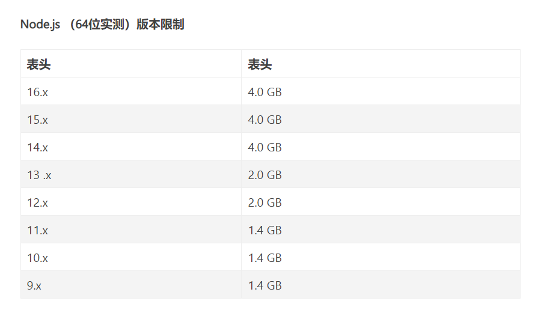

## 性能优化在工作中的实践

### 场景一-滚动卡顿

#### 背景

在某模块的列表页，存在**开始事件截图**和**结束事件截图**的选项，点击图片会将该图片进行放大，当前页面的pageSize为10，产品反馈该页面加载以及滑动卡顿严重。

#### 分析

首先，利用浏览器中的performance进行性能查看，可以观察到以下结论

* DOMContentLoaded：2.23s
* finish：23.7s；

然后，利用fps工具查看当前页面的fps（command+shift+p，搜索frame即可），刷新页面可以看到：

* fps：21

#### 结论

当前问题主要归结于2点：

* finish时间过长；
* 页面fps过低

所以，需要做的是优化图片大小、更换加载策略；

#### 方案

前端侧采用了以下方案：

* 图片压缩：列表页展示缩略图；
* 懒加载：懒加载该缩略图；
* 预加载：点击‘缩略图’以及点击‘详情’，都需要加载原图，所以提前加载；
* 并发加载：预加载图片，采用并发加载；

#### 成效

| 指标        | 优化前 | 目标    | 优化后  | 备注 |
| ----------- | ------ | ------- | ------- | ---- |
| Finish Time | 20+    | 10-     | 8 - 9   |      |
| FPS         | 20-25  | 40 - 60 | 45 - 55 |      |

#### 最后

总体上，达成了优化目标，最影响体验的卡顿问题得以解决。


### 场景二-流水线

#### 背景

在某天上线需求时，**流水线**崩了，也就是一直发布失败，进而联系运维以及其他人员，在凌辰4点左右解决流水线问题后，终于上线成功。通过观察流水线发布记录，可以发现在当日上线之前的**一周**以前，流水线构建的失败率就开始提升，在我上线需求时，失败率飚高达到80%+。

#### 分析

通过日志分析、运维侧人员以及谷歌搜索的查找，可以发现是由于内存问题所引起的崩溃问题。



进而，通过利用mac的活动监视器来查看build时的CPU状况，可以看到：

* 内存使用情况在1.83G左右；

查看流水线设置，发现当前采用的node版本为10，所以推测是**node版本引起的内存溢出问题**。

更进一步，通过流水线发布记录，发现之前上线的版本中增加了新依赖：vue-code-diff，猜测是因为该依赖问题，所以利用webpack-bundle-analyzer分析打包体积，可以发现：

* vue-code-diff：压缩后的大小为1.33M

可以看出，确实该依赖体积比较大。

为了验证该猜测，拉取上线该需求之前的代码进行build打包，通过观察内存大小，发现内存大小在1.4G左右。

**需要注意的是**，node版本存在内存限制问题（上表的值存在波动范围，并不是严格阈值）。

#### 结论

问题可以归结为：

* 在上线vue-code-diff之后，整个项目的内存就即将达到node 10内存限制的阈值；
* 在上线我需求时，内存溢出了，导致整个一系列问题；

#### 方案

主要有以下几种解决方式：

* 修改node 版本：node 版本改为了12；
* 增加node内存：“build” ： “node --man_old_space_size = 1024 * 2 node_modules/.bin/vue-cli-service build”；
* 代码或依赖优化：

  * 按需加载（lodash、echart、MTD、element ui、moment）；

  ```
  // 减少语言包打包体积
  config.plugins.push(
  	new webpack.ContextReplcementPlugin(/moment[/\\]locale$/, /zh-cn|en/);
  )
  ```

  

  * DLL（axios、vue）；

  ```
  // webpack.dll.config.js
  const webpack = require('webpack');
  const fs = require('fs');
  
  moodule.export = {
  	entry: {
  		vue_vueRouter_vuex_axios: ['vue', 'vue-router', 'vuex', 'axios'],
  		vue: ['vue'],
  		vueRouter: ['vue-router'],
  		vuex: ['vuex'],
  		axios: ['axios'],
  	},
  	output: {
  		path: fs.resolve(__dirname, 'dll'),
  		filename: '[name]_dll.js',
  		library: '[name]_lib'
  	},
  	plugins: [
  		new webpack.DLLPlugin({
  			path: fs.join(__dirname, 'dll', '[name]_manifest.json'),
  			// name与上面的library，需要对应起来
  			name: '[name]_lib'
  		})
  	]
  }
  
  -----
  将生成的文件上传到S3中
  ----
  
  // vue.config.js
  
  configureWebpack: config => {
  	if (config.mode === 'production') {
  		const dllLibNames = ['vue_vueRouter_vuex_axios'];
  		const dllCdnPublicPath = 'xxx.com';
  		const dllPlugins = [];
  		const script = [];
  		
  		dllLibNames.forEach((name, i) => {
  			dllPlugins.push({
  				new webpack.DLLReferencePlugin({
  					manifest: fs.join(dllCdnPublicPath, `${name}_manifest.json`)
  				})
  			})
  			script.push({
  				path: `${name}.dll.js`,
  				attributes: {
  					crossorigin: 'anonymous'
  				}
  			})
  			if (i === dllLibNames.length - 1) {
  				dllPlugins.push(
  					new HtmlWebpackTagsPlugin({
  						append: false,
  						publicPath: dllCdnPublicPath,
  						script
  					})
  				)
  			}
  		})
  		config.plugins.push(...dllPlugins);
  	}
  }
  
  ```

  

  * 多进程打包thread-loader：提效明显
    * 巨石项目：20+M
      * 多进程：19 - 23 s；
      * 单进程：55 - 63 s；
  
    * 轻项目：
      * 多进程：5 - 7 s；
      * 单进程：13 - 15 s；
  
  
  ```
  // vue.config.js
  
  configureWebpack: config => {
  	if (config.mode === 'production') {
  		config.module.rules.push({
  			test: '/\.js$/',
  			exclude: '/node_modules/'
  			use:[
  				{
  					loader: 'thread-loader'
  					option: {
  						workers: require('os').cpus().length - 1,
  						workerParallelJobs: 50,
  						poolTimeout: 2000
  					}
  				},
  				'babel-loader'
  			]
  		})
  		config.module.rules.push({
  			test: '/\.vue$/',
  			exclude: '/node_modules/'
  			use:[
  				{
  					loader: 'thread-loader'
  					options: {
  						workers: require('os').cpus().length - 1,
  						workerParallelJobs: 50,
  						poolTimeout: 2000
  					}
  				},
  				'vue-loader'
  			]
  		})
  		config.module.rules.push({
  			test: '/\.tsx?$/',
  			exclude: '/node_modules/'
  			use:[
  				{
  					loader: 'thread-loader'
  					options: {
  						workers: require('os').cpus().length - 1,
  						workerParallelJobs: 50,
  						poolTimeout: 2000
  					}
  				},
  				'babel-loader',
  				{
  					loader: 'thread-loader'
  					options: {
  						// 将tsx文件添加到vue文件的ts代码块中
  						appendTsxSuffixTo: ['/\.vue$/'],
  						experimentalWatchApi: true,
  						// 多进程打包，不配置的话，打包会报错
  						happyPackMode: true,
  						// 禁用类型检查，提高构建速度
  						tranpileOnly: true
  					}
  				}
  			]
  		})
  	}
  }
  ```
  
* webpack插件：写了一个注释文件大小的插件，可以清晰地看见每个文件的大小；

```
class FileSizePlugin {
  apply(compiler) {
    compiler.hooks.emit.tapAsync('FileSizePlugin', (compilation, callback) => {
      Object.keys(compilation.assets).forEach((filename) => {
        const source = compilation.assets[filename].source();
        const size = compilation.assets[filename].size() / 1024.0;
        const comment = `/* ${filename} file is ${size.toFixed(2)} Kb */\n\n`;
        compilation.assets[filename].source = () => (comment + source);
      });
      callback();
    });
  }
}

module.exports = FileSizePlugin;
```

#### 最后

总体上，提升了自己定位、思考、解决问题的能力。


### 场景三-全量加载

#### 背景

某一个页面，全量加载所有仓店数据（60000+），导致页面加载、渲染等卡顿问题。


### 场景四-自动化插入标签

* script必须是**双标签**；

```
class InsertLinkPlugin {
    constructor(options) {
        this.options = Array.isArray(options) ? options: [options];
    }
    apply(compiler) {
        compiler.hooks.emit.tapAsync('InsertLinkPlugin', (compilation, callback) => {
            let html = compilation.assets['index.html'];
            this.options.forEach(option => {
                if (/dns/.test(option.type.toLowerCase())) {
                    const tag = `<link rel="dns-prefetch" href="${option.url}" />`;
                    html = html.replace('<title>', `${tag}<title>`)
                } else if (/(js|javascript)/.test(option.type.toLowerCase())) {
                    if (option.defer) {
                        const tag = `<script rel="text/javascript" href="${option.url}" defer ></script>`;
                        html = html.replace('</body>', `${tag}</body>`)
                    } else if (option.async) {
                        const tag = `<script rel="text/javascript" href="${option.url}" async ></script>`;
                        html = html.replace('</body>', `${tag}</body>`)
                    } else {
                        const tag = `<script rel="text/javascript" href="${option.url}" ></script>`;
                        html = html.replace('</body>', `${tag}</body>`)
                    }
                } else if (/css/.test(option.type.toLowerCase())) {
                    const tag = `<link rel="stylesheet" href="${option.url}" />`;
                    html = html.replace('</body>', `${tag}</body>`)
                }
            })

            compilation.assets['index.html'] = {
                source: () => html,
                size: () => html.length
            };
            callback();
        })
    }
}

config.plugins.push(
    new InsertLinkPlugin([
        {
            url: '//lx.meituan.net',
            type: 'dns'
        },
        {
            url: '//lx.meituan.com',
            type: 'js',
            defer: true
        },
        {
            url: '//s3plus.meituan.net',
            type: 'js',
            async: true
        },
    ])
)
```

